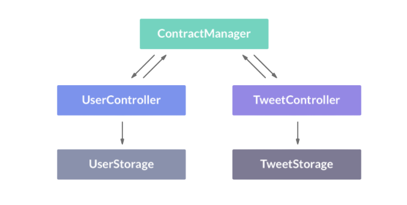
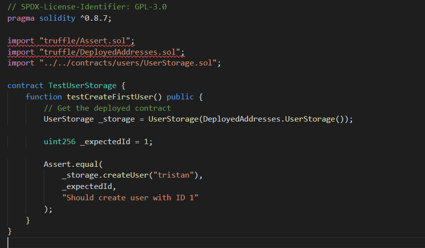
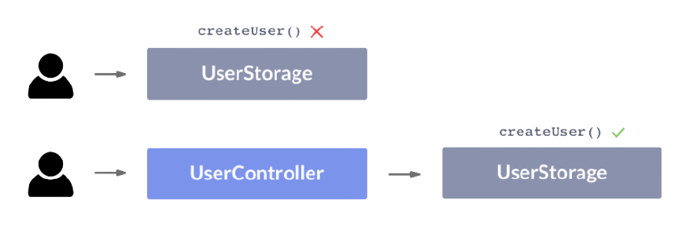
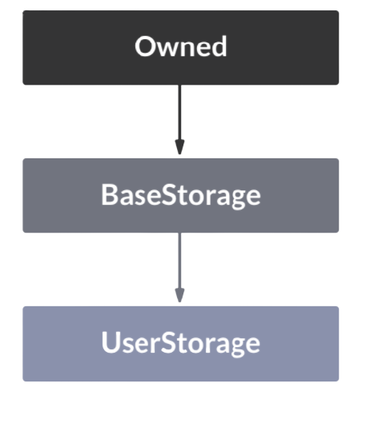
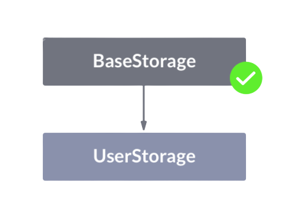
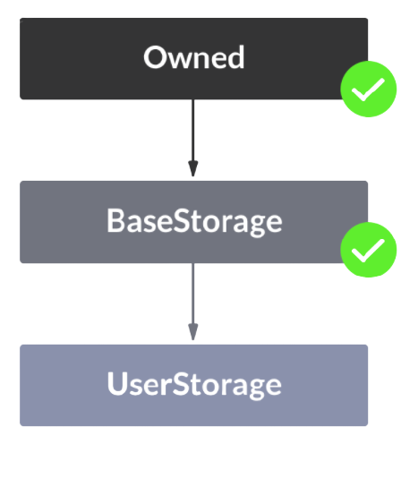
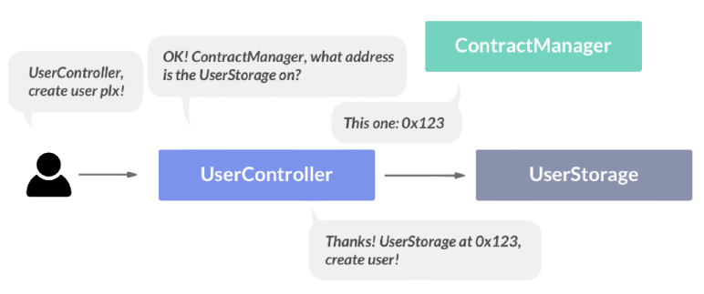

# Vulture Dapp
The concept is very simple: anyone can sign up using their Ethereum wallet. Once they are logged in, they can post tweets that are stored forever on the immutable blockchain. You should also be able to view other profiles and their tweets.

The credit for the concept, most of the explanation and contract code goes entirely to Tristan Edwards, whose blog heavily serves as base for the project presented in this repository.

Source:
https://www.ludu.co/course/ethereum - "Discover Ethereum & Solidity"

## Tutorial
Bellow you have a blog post style tutorial to build the Dapp from scratch, following the steps implemented in this youtube video:
(insert link)

## Running locally

```
brew install node
```

### Get a blockchain client

```
npm install -g ganache-cli
```

```
ganache-cli
```

## Creating Vulture
The concept is very simple: anyone can sign up using their Ethereum wallet. Once they are logged in, they can post tweets that are stored forever on the immutable blockchain. You should also be able to view other profiles and their tweets.

### A note on immutability...
The most important thing to remember when developing for Ethereum is that, once a smart contract is deployed to an address, it can no longer be changed – the code that sits on that address will be there for all eternity.

The conclusion is therefore that you shouldn't treat your smart contracts like any other code. Here are some concepts that are especially important when writing in Solidity:

1. KISS (Keep It Simple Stupid). In other words, don't overcomplicate things. What is really the purpose of your smart contract? Why does it even need to be on the blockchain? Are there some features that are better off using a traditional database? The truth is that most good smart contracts out there are incredibly basic, and strive at doing just one simple thing.

2. Decide in advance which parts should be upgradeable, and which parts should not.

3. Test, test, test! This part cannot be stressed enough. You should have tests written for every function of your smart contract before you deploy it to the mainnet.


### Planning the structure

1. Register new users
2. Find users based on their ID or username, and get their info
3. Post new tweets
4. Find tweets based on different criteria (for example their author) and read them



The idea behind our so-called "storage contracts" (like UserStorage and TweetStorage) is that they are never replaced. The reason for this is because their only task should be to store all of our data (the users and tweets). If we were to replace them some time in the future, that data is lost. Storage contracts work pretty much like databases, which is why they're sometimes referred to as "database contracts".

The controller contracts on the other hand are supposed to act as "gatekeepers" for anyone who wants to write to the storage contracts. They are responsible for all the logic and validation that our supplied information will have to go through before it is granted the privilege of being added to the blockchain. These contracts should also have the possibility to be replaced with newer versions if the logic needs to changed in the future.

Finally, we have the "Contract manager", which simply keeps track of the most recent version of each contract, and what address they are deployed to. That way, if the TweetController contract needs to get some info from the UserStorage contract for example, it can always go through the ContractManager.


Build UserStorage
```javascript
contract UserStorage {

  mapping(uint => Profile) profiles;

  struct Profile {
    uint id;
    bytes32 username;
  }

  uint latestUserId = 0;
  
  function createUser(bytes32 _username) public returns(uint) {
    latestUserId++;  

    profiles[latestUserId] = Profile(latestUserId, _username);

    return latestUserId;
  }
}
```
Write a deploy script so that the `UserStorage` can be interacted with.

```javascript
const UserStorage = artifacts.require('UserStorage');

module.exports = (deployer) => {
  deployer.deploy(UserStorage);
}
```

Create integration folder, create `users.js` and write test.
The web3 library (which is automatically injected into our test files)


```javascript
//test/integration/users.js
const UserStorage = artifacts.require('UserStorage')

contract('users', () => {

    it("can create user", async () => {
        const storage = await UserStorage.deployed()

        const username = web3.utils.fromAscii("romeu")
        const tx = await storage.createUser(username)

        console.log(tx)
    })
})
```
The test does not return the value of the createUser function, which we expected to be the latestUserId variable. Instead, it returns some kind of tx object?

This is again because createUser is a writable function that actively changes the state of the contract. In order to write something to the Ethereum blockchain, a new block has to be mined, which means that we need to make a transaction. That transaction data is what we see here.

```javascript
//test/integration/users.js
const UserStorage = artifacts.require('UserStorage')

contract('users', () => {

    it("can create user", async () => {
        const storage = await UserStorage.deployed()

        // const username = web3.utils.fromAscii("romeu")
        const tx = await storage.createUser(username)

        assert.isOk(tx) //use Chai's isOk assertion, to make sure that the tx object exists
    })
})
```
## Writing tests in Solidity

To check the returned latestUserId we'll need to create a unit test in Solidity.
Create `unit` folder inside `test` and create `TestUserStorage.sol`

```javascript
//test/unit/TestUserStorage.sol

// SPDX-License-Identifier: GPL-3.0
pragma solidity ^0.8.7;

import "truffle/Assert.sol";
import "truffle/DeployedAddresses.sol";
import "../../contracts/users/UserStorage.sol";

contract TestUserStorage {
    function testCreateFirstUser() public {
        // Get the deployed contract
        UserStorage _storage = UserStorage(DeployedAddresses.UserStorage());

        uint256 _expectedId = 1;

        Assert.equal(
            _storage.createUser("romeu"),
            _expectedId,
            "Should create user with ID 1"
        );
    }
}
```

Some things to note here:

1. All contract names related to testing (like "TestUserStorage") must start with Test (with an uppercase "T")
2. All function names related to testing (like "testCreateFirstUser") must start with test (with a lowercase "t")
3. We use the DeployedAddresses library to make sure that we get the last deployed instance of the UserStorage contract.
4. The Assert.equal function takes three parameters: the value that we want to check, the expected value to check against and a string describing what the test does.

While it can be tempting to write all tests in JavaScript, there are sometimes limitations to what you can check when going through a virtual machine. Therefore, a good mix of JavaScript tests and Solidity tests is usually key to write secure DApps.

If, like me, you are using windows and vscode you might get an import error:

If this happens use `truffle develop` to run the tests.


## Test-driven Solidity

### Retrieving the user info based on ID
To return structures in Solidity, we have to convert them to tuples, which in turn will be interpreted as arrays in the JavaScript environment.

```javascript
//test/integration/users.js
const UserStorage = artifacts.require('UserStorage')

contract('users', () => {

    it("can create user", async () => {
        const storage = await UserStorage.deployed()

        // const username = web3.utils.fromAscii("romeu")
        const tx = await storage.createUser(username)

        assert.isOk(tx) //use Chai's isOk assertion, to make sure that the tx object exists
    })

    //for:
    // struct Profile {
    //   uint id;
    //   bytes32 username;
    // }

      it("can get user", async () => {
    const storage = await UserStorage.deployed()
    const userId = 1
    
    // Get the userInfo array
    const userInfo = await storage.getUserFromId.call(userId)
    // the first element (of index 0) represents the ID, and the second one (of index 1) is the username
    
    // Get the second element (the username)
    const username = userInfo[1]

    assert.equal(username, "romeu")
  });
})
```
 The first element (of index 0) represents the ID, and the second one (of index 1) is the username.

The tests will fail.

```javascript
const username = web3.utils.toAscii(userInfo[1])
```

And even after converting the bytes32 value name to string the test will fail, due to the fact that it's a bytes32 object and therefore must be exactly 32 characters long. \u000 is simply a representation of a "null" character.

```
 AssertionError: expected 'romeu\u0000\u0000\u0000\u0000\u0000\u0000\u0000\u0000\u0000\u0000\u0000\u0000\u0000\u0000\u0000\u0000\u0000\u0000\u0000\u0000\u0000\u0000\u0000\u0000\u0000\u0000\u0000' to equal 'romeu'
      + expected - actual
```

To remove these trailing null characters, we can simply replace them through a simple JavaScript RegEx

```javascript
    const username = web3.utils.toAscii(userInfo[1]).replace(/\u0000/g, '')
```

While our Solidity code above works great, there's actually a cleaner way to get all information for a profile.
By adding the keyword public in front of our `profiles` state variable, Solidity will automatically generate the getter function for us. In other words, we can skip the getUserFromId function altogether!

```javascript
  mapping(uint => Profile) public profiles;
```
Change the corresponding test (//6).

### Create the TweetStorage contract

Now test the following:
1. Creating a new tweet (and get its newly added ID)

2. Get a tweet's data based on its ID (for now, that info will be the tweet's ID, text, author ID and creation date).

Write the solidity test for getting testing the createTweet function.

```javascript
//contracts/tweets/TweetStorage.sol

contract TweetStorage {
  // SPDX-License-Identifier: GPL-3.0
  pragma solidity ^0.8.7; 

  mapping(uint => Tweet) public tweets;
  
  struct Tweet {
    uint id;
    string text;
    uint userId;
    uint postedAt;
  }

  uint latestTweetId = 0;

  function createTweet(uint _userId, string memory _text) public returns(uint) {
    latestTweetId++;

    tweets[latestTweetId] = Tweet(latestTweetId, _text, _userId, now);

    return latestTweetId;
  }

}

```

### Getting the Tweet data 
<mark>**12**</mark>
Write a test in javascript as na unit test would result in error since one cannot pass strings from one contract to another in solidity.

<mark>**13**</mark>
Our Solidity tests and JavaScript tests are completely separate! Just because we've created the tweet in our Solidity test, does not mean we can retrieve it in our JavaScript test – each test in Truffle uses a clean room environment so that they don't accidentally share state with each other (which is a good thing)!

```javascript
const TweetStorage = artifacts.require('TweetStorage')

contract('tweets', () =>{

    it("can get tweet", async () => {
        // 13  each test in Truffle uses a clean room environment to avoid state sharing
        before(async() => {
            const tweetStorage = await TweetStorage.deployed()
            await tweetStorage.createTweet(1, "Hello world!")
        })
        //

        const storage = await TweetStorage.deployed()

        const tweet = await storage.tweets.call(1) //get the data
        const { id, text, userId} = tweet // Destructure the data

        // Check if the different parts contain the expected values
        assert.equal(parseInt(id), 1)
        assert.equal(text, "Hello world!")
        assert.equal(parseInt(userId), 1)

        //web3 users `bigNumber` to  support Ethereum's standard 
        //numeric data type (which is much larger than the one built into JavaScript).
        //because the numbers in this test are small we can use `parseInt()`
    })
})
```
## Inheritance and modifiers

At this point in, our current TweetStorage contract, anyone can create a tweet on behalf of any user simply by passing their user ID as a parameter.

```javascript
// contracts/tweets/TweetStorage.sol
function createTweet(uint _userId, string memory _text) public returns(uint) {
  latestTweetId++;

  tweets[latestTweetId] = Tweet(latestTweetId, _text, _userId, now);

  return latestTweetId;
}
```
We also don't do any checks in our createUser function to see if the username is taken:

```javascript
// contracts/users/UserStorage.sol
function createUser(bytes32 _username) public returns(uint) {
  latestUserId++;  

  profiles[latestUserId] = Profile(latestUserId, _username);

  return latestUserId;
}
```

 It is risky to add too much logic in our storage contracts, since they cannot be updated after being deployed without also clearing all their stored data. Therefore, we want to keep them as simple as possible, and instead let upgradable controller contracts handle the bulk of the logic.

 

 ## Working with permissions
 Add  `TweetController.sol` to the `tweets` folder, and `UserController.sol` to the `users`folder.

 Solidity has a special variable that's accessible in all contract functions, called msg.sender. It represents the Ethereum address that's calling the contract. So for the createUser function in UserStorage, we should simply make sure that msg.sender is equal to the address that UserController is deployed to!

  

  We can use Solidity's require function to make sure that a condition is met before proceeding to the next line of code. It the requirement fails, it will throw an error:

<mark>**14**</mark>

```javascript
  // SPDX-License-Identifier: GPL-3.0
pragma solidity ^0.8.7;

contract UserStorage {
    //4 add public
    mapping(uint256 => Profile) public profiles;
    //

    struct Profile {
        uint256 id;
        bytes32 username;
    }

    uint256 latestUserId = 0;
    
    //14 
    address ownerAddr;
    address controllerAddr;

    function setControllerAddr(address _controllerAddr) public {
        require(msg.sender == ownerAddr);
        controllerAddr = _controllerAddr;
    }
    //


    function createUser(bytes32 _username) public returns (uint256) {
        // 14
        require(msg.sender == controllerAddr);
        //

        latestUserId++;

        profiles[latestUserId] = Profile(latestUserId, _username);

        return latestUserId;
    }

    //5 By adding the keyword public in front of the profiles state variable,
    // solidity will generate a getter and we can skip the getUserFromId function

    // function getUserFromId(uint256 _userId)
    //     public
    //     view
    //     returns (uint256, bytes32)
    // {
    //     return (profiles[_userId].id, profiles[_userId].username);
    // }
}
```
 As you can see, this is getting pretty complicated, and we're introducing state variables like ownerAddr and controllerAddr which don't really have anything to do with our users. To make all this a little less complex, let's extract this new logic into some Solidity helper libraries instead!


## Helper libraries and Inheritance
Solidity makes it possible for contracts to inherit properties from other contracts, which is useful if:

*  you want to extract some of the logic into another file;
*  you have logic that should be duplicated across contracts.

In our UserStorage contract above, we have two features that could be inherited from a more general contract library:

1. Setting the owner of the contract, and making sure that some functions are limited to its address (ownerAddr)

2. Setting the controller of the contract, and making sure that some functions are limited to its address (controllerAddr)

Create a `helpers` folder inside the `contracts` folder and create `BaseStorage.sol` and `Owned.sol`inside `helpers`.

The idea is that our `UserStorage` inherits from `BaseStorage` (which sets the controllerAddr for the storage contract), and `BaseStorage` itself inherits from `Owned` (which sets the `ownerAddr` for the storage contract).

 

 <mark>**15**</mark>  import BaseStorage.sol and add `is` keyword.

 ```javascript
//...
import '../helpers/BaseStorage.sol';
contract UserStorage is BaseStorage {
  // ...
}
 ```

 Note that we don't have to deploy BaseStorage separately from UserStorage when it's used as a library. Instead, UserStorage will simply copy all the logic that it needs from BaseStorage at compilation time.

 Remove `controllerAdd` and `setControllerAddr` from the `UserStorage` contract, since we're inheriting them instead.

  

  Next, we want BaseStorage to inherit from Owned, since it's expecting to find an ownerAddr state .

```javascript
//contracts/helpers/Owned.sol
contract Owned {
  address public ownerAddr;

  constructor() public {
    ownerAddr = msg.sender;
  }

  function transferOwnership(address _newOwner) public {
    // Only the current owner can set a new ownerAddr:
    require(msg.sender === ownerAddr);
    
    // The new address cannot be null:
    require(_newOwner != address(0));

    ownerAddr = _newOwner;
  }
}
```
Notice how we have a special `constructor` function inside the `Owned` contract? This function runs only once, when the contract is deployed, and then never again.

By getting the `msg.sender` inside the constructor, we are getting the address that's deploying the contract for the very first time. This is a very common way of setting the initial `ownerAddr` securely.

We've also added a `transferOwnership` function just in case we need to change the owner at some point in the future. As you can see, we've added some `require` functions to make sure that only the owner can call this function, and that the new address isn't empty (`address(0)` is the same as the empty address `0x0`).

<mark>**16**</mark>  Now make sure that `BaseStorage` inherits from `Owned`.

```javascript
pragma solidity ^0.8.7;

import './Owned.sol';

contract BaseStorage is Owned {
}
```
<mark>**17**</mark> 
With this we have made it possible for UserStorage to access all the state variables needed for checking permissions (ownerAddr and controllerAddr) without polluting the contract code with irrelevant functions.

 

 ## Using modifiers
 There's one last improvement that we could use in our contracts before we move on to making our tests pass. To avoid having a lot of logic involving checking who the `msg.sender` is (by repeating the following line)

 ```javascript
 require(msg.sender == ownerAddr)
 ```
  we can use modifiers.
  Modifiers are used to "wrap" some additional functionality around a function, and are similar to decorators in object-oriented programming.

  <mark>**18**</mark>  Add a modifier in `Owned.sol`
  ```javascript
  contract Owned {
  // ...
  modifier onlyOwner() {
    require(msg.sender == ownerAddr);
    _;
  }
  // ...
}
  ```
Now let's add the modifier where  `require(msg.sender == ownerAddr)` is used trough out our contract.

<mark>**19**</mark> 
 Also add an `onlyController` modifier in `BaseStorage` to substitute the use of `require(msg.sender == controllerAddr)`;

## Duplicating the logic to TweetStorage
<mark>**20**</mark> 
Inside `TweetStorage.sol`, add the `onlyController` modifier to the `createTweet` (and inherit from `BaseStorage`.

```javascript
// contracts/tweets/TweetStorage.sol

// Import the BaseStorage contract
import '../helpers/BaseStorage.sol';

// Make sure TweetStorage inherits from it
contract TweetStorage is BaseStorage {
  // ...
  
  // Add the "onlyController" modifier:
  function createTweet(uint _userId, string _text) public onlyController returns(uint _newTweetId) {
    // ...
  }
}
```
Now we have to rewrite the tests to fit the new contract structure.

## The deployment orchestra
To make our storage and controller contracts work together, we need to deploy them in a very specific order, because of the use of the `onlyController` modifier in some functions of the storage contracts. 
They need to be aware of what address their respective controllers have been uploaded to.
Based on the code, here's what we should do:
1. Deploy the `UserStorage` and `TweetStorage` contracts (as we do now)
2. Deploy the `UserController` and `TweetController` contracts
3. Get the deployed instances of `UserStorage` and `TweetStorage` (so that we can interact with them in our migration files)
4. Set the `controllerAddr` in the deployed `UserStorage` and `TweetStorage` contracts

<mark>**21**</mark> 
The first one is already done, so we'll start by creating a new migration file where we deploy our `UserController` and `TweetController` contracts. We can call it `3_deploy_controllers.js`.

By using an array inside the deployer.deploy function, we get a resolved promise once they're both done:

<mark>**22**</mark> 
After that, we want to get the deployed versions of our storage contracts. We can do this by calling the .deployed() method on the contracts.

<mark>**23**</mark> 
Finally, we call the `setControllerAddr` function on the two storage contracts instances. In order to get the deployed addresses for `UserStorage` and `TweetStorage`, we simply type `UserStorage.address` and `TweetStorage.address`. The address property becomes available on the contract object ***after*** it's been deployed.

```javascript
//migrations/3_deploy_controllers.js

//21
const UserController = artifacts.require('UserController')
const TweetController = artifacts.require('TweetController')

module.exports = (deployer) => {

  // Deploy controllers contracts:
  deployer.then(async () => {
    await deployer.deploy(UserController);
    await deployer.deploy(TweetController);
  })
}

//22
// Since we want to get the storage contract instances,
// we need to import them!
const UserStorage = artifacts.require('UserStorage');
const TweetStorage = artifacts.require('TweetStorage');

module.exports = (deployer) => {

  deployer.then(async () => {
    await deployer.deploy(UserController);
    await deployer.deploy(TweetController);
  })
  // Get the deployed storage contract instances:
  .then(() => {
    return Promise.all([
      UserStorage.deployed(),
      TweetStorage.deployed(),
    ]);
  })
//23 set the controller address on both storage contracts:
.then(storageContracts => {
    const [userStorage, tweetStorage] = storageContracts;

    return Promise.all([
      userStorage.setControllerAddr(UserController.address),
      tweetStorage.setControllerAddr(TweetController.address),
    ]);
  })
}
```

## Handling errors in tests
If a user tries to call createUser or createTweet by calling the storage contract directly for example, we should expect an error, since they're not going through the controller like we want them to.

<mark>**24**</mark> 
To test this behavior, let's create a new test at the very top of `test/integration/users.js` called "can't create user without controller". 

```javascript
// test/integration/users.js
contract('users', () => {
  it("can't create user without controller", async () => {
    const storage = await UserStorage.deployed()

    try {
      const username = web3.utils.fromAscii("romeu")
      await storage.createUser(username)
      assert.fail()
    } catch (err) {
      console.log(err);
    }
  })
  // ...
})
```
<mark>**25**</mark> 
We will get an error containing the string `"VM Exception"`. Let´s create a function in a new `utils.js`file inside the test folder to handle that. Make the change inside the `users.js`and <mark>**26**</mark>  `tweet.js`files. 

## Adding a contract manager

Since our controllers are supposed to call functions in our storage contracts, they obviously need to know what address these storage contracts are deployed to.

<mark>**26**</mark> To make this work, we'll build a ContractManager that keeps track of all contracts' addresses.


 
The functions needed in the contract manager are the following:
1. Add new key-value records, with a string (ex: "UserStorage") pointing to an address (ex: "0xde0b295669a9fd93d5")
2. Get an address based on the string key.
3. Delete the address of a string key.
4. All these functions should obviously only be available to the owner of the contract, so we'll first of all make our contract inherit from Owned.

```javascript
//contracts/ContractManager.sol
pragma solidity ^0.8.7;

import './helpers/Owned.sol';

contract ContractManager is Owned {
  mapping (string => address) addresses;

  function setAddress(string memory _name, address _address) public {
    addresses[_name] = _address;
  }

  function getAddress(string memory _name) public view returns (address) {
    return addresses[_name];
  }

  function deleteAddress(string memory _name) public {
    addresses[_name] = address(0);
  }
}
```

## Rethinking our deployment strategy
Immutability is an important aspect of the Ethereum ecosystem, so it's essential to plan ahead when writing Solidity contracts. This goes for migration files too.

In Truffle, we ideally want to separate the migration files so that we can run just one of them in isolation if some aspect of the code changes.

Some migration files, such as 2_deploy_storage.js will never be run more than once (since that would reset its stored data). 

When it comes to the controllers however, the best case scenario would be if when we update, say, our UserController, we could run just a single migration file which takes care of replacing our contract, set the new controller address in the storage and updating the contract manager – all in one sweep.

<mark>**27**</mark> 
You can safely delete the 3_deploy_controllers.js file (below)

```javascript
//3_deploy_controllers.js
const UserController = artifacts.require('UserController')
const TweetController = artifacts.require('TweetController')

module.exports = (deployer) => {

  deployer.then(async () => {
    await deployer.deploy(UserController);
    await deployer.deploy(TweetController);
  })
}

// we need to import them!
const UserStorage = artifacts.require('UserStorage');
const TweetStorage = artifacts.require('TweetStorage');

module.exports = (deployer) => {

  deployer.then(async () => {
    await deployer.deploy(UserController);
    await deployer.deploy(TweetController);
  })
  // Get the deployed storage contract instances:
  .then(() => {
    return Promise.all([
      UserStorage.deployed(),
      TweetStorage.deployed(),
    ]);
  })
//set the controller address on both storage contracts:
.then(storageContracts => {
    const [userStorage, tweetStorage] = storageContracts;

    return Promise.all([
      userStorage.setControllerAddr(UserController.address),
      tweetStorage.setControllerAddr(TweetController.address),
    ]);
  })
}
```
so that we can instead create one called 3_deploy_manager.js. Similarly to 2_deploy_storage.js, this one should only have to be deployed once.

```javascript
//migrations/3_deploy_manager.js
const ContractManager = artifacts.require('ContractManager')
const UserStorage = artifacts.require('UserStorage');
const TweetStorage = artifacts.require('TweetStorage');

module.exports = (deployer) => {
  
  deployer.deploy(ContractManager)
  .then(() => {
    return ContractManager.deployed()
  })
  .then(manager => {
    return Promise.all([
      manager.setAddress("UserStorage", UserStorage.address),
      manager.setAddress("TweetStorage", TweetStorage.address),
    ])
  })
}
```
<mark>**28**</mark> 

Next, create two deployment files for our controllers – one for the `UserController` and one for the `TweetController`.

In these migrations, we need to make sure that our controllers have the address of the deployed ContractManager. If they have that address, then they can get the address of every other deployed contract too.

For this, we'll first create a library called BaseController that our UserController and TweetController will inherit from:

```javascript
//contracts/helpers/BaseController.sol
pragma solidity ^0.8.7;

import './Owned.sol';

contract BaseController is Owned {
   // The Contract Manager's address
  address managerAddr;
  function setManagerAddr(address _managerAddr) public onlyOwner {
    managerAddr = _managerAddr; 
  }
}
```

<mark>**29**</mark> As you can see, all BaseController does is set the managerAddr state variable using the setManagerAddr function. Now we just need to make sure that TweetController and UserController inherit from it.

<mark>**30**</mark> We're ready to write our two migration files!

(`migrations/4_deploy_usercontroller.js`, `migrations/5_deploy_tweetcontroller.js`)
 These should:

1. Deploy their dedicated controller contract
2. Set the ContractManager's address in the controller
3. Set the controller's address in the ContractManager
4. Set the controller's address in the storage contract that goes with it

Run 'truffle test' or 'test' once more to make sure that the contracts are being deployed as expected.

## Updating our unit test
Remember, our unit tests run our contracts in isolation, so there's no interaction between our controller contracts and storage contracts. In other words, we can't make our controller contract call a function on the deployed storage contract in a unit test.

<mark>**31**</mark> 
We then need to crate a brand new instance of `UserStorage` inside the test's constructor, and manually call `setControllerAddr` on it.

```javascript

pragma solidity ^0.8.7;
//test/unit/TestUserStorage.sol
import "truffle/Assert.sol";
import "../../contracts/users/UserStorage.sol";

contract TestUserStorage {
  UserStorage userStorage;

  constructor() public {
    userStorage = new UserStorage();
    userStorage.setControllerAddr(address(this));
  }

  function testCreateFirstUser() public {
    uint _expectedId = 1;

    Assert.equal(userStorage.createUser("romeu"), _expectedId, "Should create user with ID 1");
  }

}
```
Do the same exact thing for `TestTweetStorage`, but this time with `TweetStorage`.

## Building the controllers
To round this up, we need to actually make our controllers work by adding some functions to them that will forward data to their respective storage contracts. We'll start with the user controller.

<mark>**32**</mark> 
First of all, we'll go to the users' integration test file, remove the test called "can create user" and replace it with one called "can create user with controller".
Now create the `createUser` function in the `UserController`.
The function will fetch the deployed UserStorage instance through the ContractManager, and send its arguments to that instance's own createUser function:

```javascript
//contracts/users/UserController.sol
pragma solidity ^0.8.7;

import '../helpers/BaseController.sol';
import '../ContractManager.sol';
import './UserStorage.sol';

contract UserController is BaseController {

  function createUser(bytes32 _username) public returns(uint) {
    ContractManager _manager = ContractManager(managerAddr);

    address _userStorageAddr = _manager.getAddress("UserStorage");
    UserStorage _userStorage = UserStorage(_userStorageAddr); 

    return _userStorage.createUser(_username);
  }
}
```
Do the exact same thing with `TweetController`and the `createTweet` function, and add "create tweet controller" to the tests.

## Using Metamask

When it comes to building a web app, there are many options. The only requirement is that you need a library like web3.js which can connect your web app to the Ethereum blockchain.

## Next.js

## Install Metamask
There are 3 test networks (Ropsten, Kovan and Rinkeby), which use a shared blockchain that everyone can connect to, but where the network is deliberately slow and ether is practically free.

We also have our local network (localhost:8545), which we initiated when we ran the ganache-cli command, and only exists on our computer. This is the one that we want to connect to for now!

Let's create a file called provider.js in a new web3 folder.

